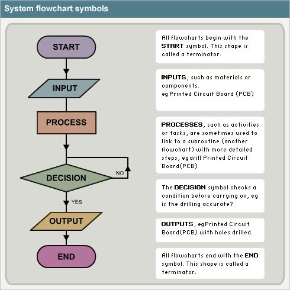
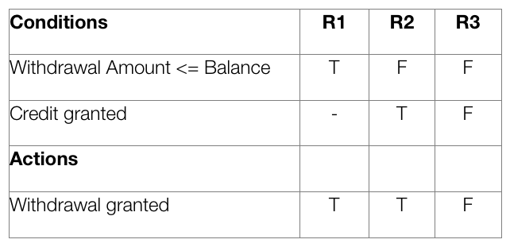

# Algorithmic Representation
The following will be covered:
- Using pseudocode and flowchart to show program flow
- Standard flowchart symbols
- Using a combination of control structures, namely
	- Selection
	- Iteration
	- Sequence
- Using decision tables to explore the actions of combinations of different input conditions *Up to three conditions*
- Use modular design to decompose a problem into smaller problems

The above is extracted from the [2021 H2 Computing Syllabus](https://www.seab.gov.sg/docs/default-source/national-examinations/syllabus/alevel/2021syllabus/9569_y21_sy.pdf).
## Control structures
Flow of control in a program is implemented with three basic types of control structures:
- Sequence
	- The default flow. One line after another.
- Selection
	- Used for decisions/branching.
	- Examples: `if`, `if/else`, `switch`
- Iteration
	- Used for looping
	- Examples: `while`, `for`

## Pseudocode
Pseudocode, is an artificial and informal language that describes the steps in an algorithm. There is no standard way of writing pseudocode, but **consistency** with the use of your syntax is key.

- Common keywords: `IF`, `WHILE`, `INPUT`, `ELSE`, `FOR`. 
- It is to be noted that every control statement should be enclosed correspondingly, such as `IF` with `ENDIF`

An example of pseudocode will be:
```
FUNCTION functionname(parameters)
	WHILE condition DO
		FOR iteration bounds DO
			IF condition THEN
				CALL subprocedure1
			ELSE
				sequence 2
			ENDIF
		ENDFOR
	ENDWHILE
ENDFUNCTION
```

## Flowchart
Flowcharts use special shapes to represent different types of actions or steps in a process.

```ad-note
Flowchart symbols must be strictly followed
```
## Decision Table

A decision table is a tabular representation of inputs versus test conditions.

An example of a decision table:
